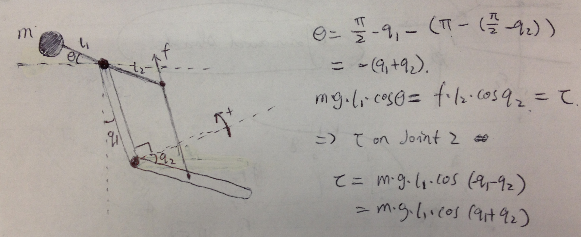

<!-- START doctoc generated TOC please keep comment here to allow auto update -->
<!-- DON'T EDIT THIS SECTION, INSTEAD RE-RUN doctoc TO UPDATE -->
**Table of Contents**  *generated with [DocToc](http://doctoc.herokuapp.com/)*

- [Gravity Compensation](#gravity-compensation)
    - [DH Parameters](#dh-parameters)
    - [Simulation](#simulation)
    - [Summary](#summary)
  - [MTM Dynamatics](#mtm-dynamatics)
    - [Parallel Mechanism](#parallel-mechanism)
  - [Demo Video](#demo-video)
    - [Other Approaches](#other-approaches)
  - [Appendix I: MTM DH Parameters](#appendix-i-mtm-dh-parameters)
  - [Appendix II: KDL with DH parameters](#appendix-ii-kdl-with-dh-parameters)
  - [Appendix III: Matlab Toolbox](#appendix-iii-matlab-toolbox)

<!-- END doctoc generated TOC please keep comment here to allow auto update -->

# **This page is deprecated**

Please check README.md on https://github.com/jhu-dvrk/dvrk-gravity-compensation instead.

# Gravity Compensation

In ideal case, given robot link mass and center of mass, Recursive Newton Euler (RNE) algorithm can be used to compute gravity compensation terms. To get this correct, we need two things:
* A correct implementation of RNE
* Robot model
  * Kinematics: DH Parameters
  * Dynamatics: Link mass & Center of Mass (COM)

In this section, we use a simple two link RR robot (RRBot in Gazebo tutorial) as a testbed 
for different robot kinematics and dynamics libraries in particular **cisstRobot** and **KDL** (See Appendix II). The robot parameters are known and described in an URDF file. Also MATLAB Robotics Vision & Control (RVC) toolbox is used as reference. Besides, we send computed values to Gazebo Simulator to visually check the values. 

See: 
* Gazebo tutorial: http://gazebosim.org/wiki/Tutorials/1.9/Using_A_URDF_In_Gazebo
* Code: https://github.com/ros-simulation/gazebo_ros_demos
* Code: https://github.com/ros-simulation/gazebo_ros_demos


### DH Parameters 

 

Table: Standard DH for RRBot  

| Frame | Joint Name | alpha |  a  | d   | theta |
|:-----:|------------|:-----:|:---:|-----|-------|
| 1     | Joint 1    | 0     | 0.9 | 0   | q1    |
| 2     | Joint 2    | 0     | 0.9 | 0.1 | q2    |


Table: Modified DH for RRBot  

| Frame | Joint Name | alpha |  a  | d   | theta |
|:-----:|------------|:-----:|:---:|-----|-------|
| 1     | Joint 1    | 0     | 0.0 | 0   | q1    |
| 2     | Joint 2    | 0     | 0.9 | 0.1 | q2    |
| 3     | Tip        | 0     | 0.9 | 0   | 0     |


### Simulation
A Gazebo model plugin has been written for testing. 

Code Repository: 
https://github.com/zchen24/gazebo_ros_demos


### Summary
CisstRobot & KDL have been tested in this simple case using both Standard and Modified DH parameters. 

|                | Cisst Robot |       KDL       | Matlab |
|----------------|:-----------:|:---------------:|:------:|
| Kinematics Std | YES         | YES             | YES    |
| Kinematics Mod | YES         | YES             | YES    |
| Gravity Std    | YES         | YES             | YES    |
| Gravity Mod    | NO          | NO (? Not sure) | YES    |


NOTE: 
1. center mass is with reference to link frame 
2. use Standard DH for dynamics 


## MTM Dynamatics 

**NOTE:**  
* COM is with reference to link frame (Standard DH)
* Unit: m, kg 

**Link 7: Wrist Roll**  
NOTE: no mass, information is integrated to link 6  

**Link 6: Wrist Yaw**

| Link | Mass | COM                  | Comment                 |
|------|------|----------------------|-------------------------|
| 6    | 0.05 | [0.0 -0.025 0.05]    | Motor is heavy          |


**Link 5: Wrist Pitch**  
**NOTE:** Left / Right are mirrored, different COM

| Link | Mass | COM                  | Comment                 |
|------|------|----------------------|-------------------------|
| 5    | 0.04 | [0.0  0.036 -0.065]  | MTMR                    |
| 5    | 0.04 | [0.0 -0.036 -0.065]  | MTML                    |

NOTE: massive spring here, don't know how to deal with this.

**Link 4: Setup Joint (Platform)**  
**NOTE:** Left / Right are mirrored, different COM

| Link | Mass | COM                  | Comment                 |
|------|------|----------------------|-------------------------|
| 4    | 0.14 | [0.0 -0.084 -0.12]   | MTMR                    |
| 4    | 0.14 | [0.0 -0.084  0.12]   | MTML                    |


**Link 3: Outer Pitch 2 (Elbow)**

| Link | Mass | COM                  | Comment                 |
|------|------|----------------------|-------------------------|
| 3    | 0.04 | [-0.25 0.00  0.00]   |  Parallel Mechanism     |


```cpp
taugc = torque computed using RNE  
tau(3) = taugc(3) - m * g * cos(q2 + q3)   // parallel 
if (q[3] < 0.05) tau[3] += ((q[3] - 0.05) * 0.1 - 0.07);  // cable
```

### Parallel Mechanism
  


**Link 2: Outer Pitch 1 (Shoulder)**

| Link | Mass | COM                  | Comment                 |
|------|------|----------------------|-------------------------|
| 3    | 0.65 | [-0.38 0.00  0.00]   |                         |

NOTE: huge mass at the top of this link, thus the COM is at the top. 

```cpp
tau[2] = taugc - 0.30    // 0.30 is offset for cable
if (q[2] < 0.05) tau[2] += (q[2] - 0.05) * 1.0 + 0.05   // cable 
```

**Link 1: Outer Yaw**

| Link | Mass | COM                  | Comment                 |
|------|------|----------------------|-------------------------|
| 1    | 0.00 | [0.00 0.00 0.00]     |                         |

```cpp
// Cable MTMR at JHU
tau[1] = -0.1 * qd[1]    // add damping
if (q[1] > -0.15) tau[1] = tau(1) + (q[1] - (-0.15)) * 0.1 + 0.04; 
```

NOTE: 
* Disk set mass to 0, does not affect RNE computation
* Huge cable force 


## Demo Video 

[](http://youtu.be/jWGB_uCqjmg) 


### Other Approaches 
See:  
Atkeson, Christopher G., Chae H. An, and John M. Hollerbach. "Estimation of inertial parameters of manipulator loads and links." The International Journal of Robotics Research 5.3 (1986): 101-119.

??? Anyone wants to try ???


## Appendix I: MTM DH Parameters

**Standard DH Parameters**

  
Image from Adnan Munawar (WPI)


Table 1: Standard DH for MTM

| Frame | Joint Name    | alpha |     a     | d | theta     |
|:-----:|---------------|:-----:|:---------:|---|-----------|
| 1     | Outer Yaw     | pi/2  | 0         | 0 | q1 - pi/2 |
| 2     | Outer Pitch 1 | 0     | l_arm     | 0 | q2 - pi/2 |
| 3     | Outer Pitch 2 | -pi/2 | l_forearm | 0 | q3 + pi/2 |
| 4     | Setup Joint   | pi/2  | 0         | h | q4        |
| 5     | Wrist Pitch   | -pi/2 | 0         | 0 | q5        |
| 6     | Wrist Yaw     | pi/2  | 0         | 0 | q6 - pi/2 |
| 7     | Wrist Roll    | 0     | 0         | 0 | q7 + pi/2 |


***


**Modified DH Parameters**


  
Image from ISI da Vinci Research Kit Manual 


| Frame | Joint Name    | alpha |      a     | d | theta     |
|:-----:|---------------|:-----:|:----------:|---|-----------|
| 1     | Outer Yaw     | 0     | 0          | 0 | q1 + pi/2 |
| 2     | Outer Pitch 1 | -pi/2 | 0          | 0 | q2 - pi/2 |
| 3     | Outer Pitch 2 | 0     | -l_arm     | 0 | q3 + pi/2 |
| 4     | Setup Joint   | pi/2  | -l_forearm | h | q4        |
| 5     | Wrist Pitch   | -pi/2 | 0          | 0 | q5        |
| 6     | Wrist Yaw     | pi/2  | 0          | 0 | q6 + pi/2 |
| 7     | Wrist Roll    | pi/2  | 0          | 0 | q7 + pi/2 |


## Appendix II: KDL with DH parameters 

Kinematics and Dynamics Library (KDL) is a library that supports chain/tree like manipulator 
kinematics and dynamics computation. By default, it uses frame to represent adjacent joint/link 
relations, which is more flexiable. DH parameter is also supported as showed in the following 
code snippet. 


Table: Standard DH for RRBot  

| Frame | Joint Name | alpha |  a  | d | theta |
|:-----:|------------|:-----:|:---:|---|-------|
| 1     | Joint 1    | 0     | 0.9 | 0 | q1    |
| 2     | Joint 2    | 0     | 0.9 | 0 | q2    |


```cpp
#include <kdl/chainfksolverpos_recursive.hpp>
#include <kdl/chainidsolver_recursive_newton_euler.hpp>

// Construct KDL 
KDL::Chain RRBotKdl;
inert = KDL::RigidBodyInertia(1.0, KDL::Vector(-0.45, 0, 0), 
                              KDL::RotationalInertia(1, 1, 1, 0, 0, 0));
RRBotKdl.addSegment(KDL::Segment(KDL::Joint(KDL::Joint::RotZ), 
                    KDL::Frame::DH(0.9, 0.0, 0.0, 0.0), inert));
RRBotKdl.addSegment(KDL::Segment(KDL::Joint(KDL::Joint::RotZ), 
                    KDL::Frame::DH(0.9, 0.0, 0.1, 0.0), inert));

// Get some joint pos, vel, acc values
KDL::JntArray jnt_q(mNumJnts);
KDL::JntArray jnt_qd(mNumJnts);
KDL::JntArray jnt_qdd(mNumJnts);
KDL::JntArray jnt_taugc(mNumJnts);
KDL::Wrenches jnt_wrenches;
for (unsigned int i = 0; i < mNumJnts; i++) {
  jnt_q(i) = q[i];
  jnt_qd(i) = 0.0;
  jnt_qdd(i) = 0.0;
  jnt_wrenches.push_back(KDL::Wrench());
}

// Kinematics 
KDL::ChainFkSolverPos_recursive fkSolver = KDL::ChainFkSolverPos_recursive(RRBotKdl);
KDL::Frame fkKDL;
fkSolver.JntToCart(jnt_q, fkKDL);

// Compute Dynamics 
KDL::Vector gravity(-9.81, 0.0, 0.0);
KDL::ChainIdSolver_RNE gcSolver = KDL::ChainIdSolver_RNE(RRBotKdl, gravity);
ret = gcSolver.CartToJnt(jnt_q, jnt_qd, jnt_qdd, jnt_wrenches,jnt_taugc);
if (ret < 0) ROS_ERROR("KDL: inverse dynamics ERROR");
```

NOTE:
Support both standard & modified DH 
Wrenches 

Reference: 
* ROS Answers: http://answers.ros.org/question/9545/kdl-for-arm/
  * NOTE: Jon Bohren mentioned first joint should be fixed, don't understand why 
* http://www.orocos.org/wiki/orocos/kdl-wiki


## Appendix III: Matlab Toolbox 

```matlab
% start rvc toolbox
startup_rvc

% construct DH robot 

% L(1) 1st Revolute
L(1) = Link([0 0 0 pi/2 0]); 
L(1).offset = -pi/2;
L(1).m = 0.00;
L(1).r = [0 0 0];
L(1).I = [0.001, 0.001, 0.001, 0, 0, 0];
L(1).G = 1;
L(1).Jm = 0.0;

% L(2) 2nd Revolute
L(2) = Link([0 0 l_arm 0 0]); 
L(2).offset = -pi/2;
L(2).m = 0.10;
L(2).r = [-0.1794, 0, 0];
L(2).I = [0.001, 0.001, 0.001, 0, 0, 0];
L(2).G = 1;
L(2).Jm = 0.0;

% Create Serial Link
rob = SerialLink(L, 'name', 'Two link robot', ...
    'manufacturer', 'Zihan');


% Forward Kinematics
rob.fkine(q)

% Gravity 
rob.gravload(q)

```

NOTE: it also supports symbolic computation

**List of codes:**    
* mdl_mtm.m: create MTM model with standard DH
* mdl_mtm_modified.m: create MTM model with modified DH 
* mdl_psm.m: create PSM model with modified DH

**Reference:**  
* Robotics, Vision and Control by Peter Corke  
  * Chapter 5: kinematics 
  * Chapter 7: dynamics 
  * NOTE: more examples can be found in the book
